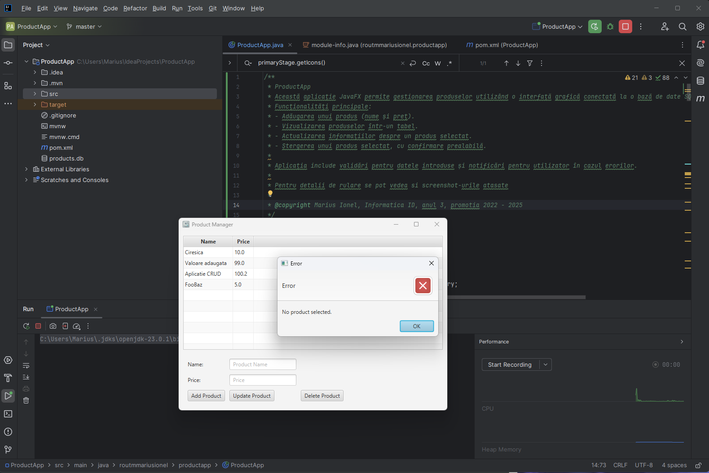
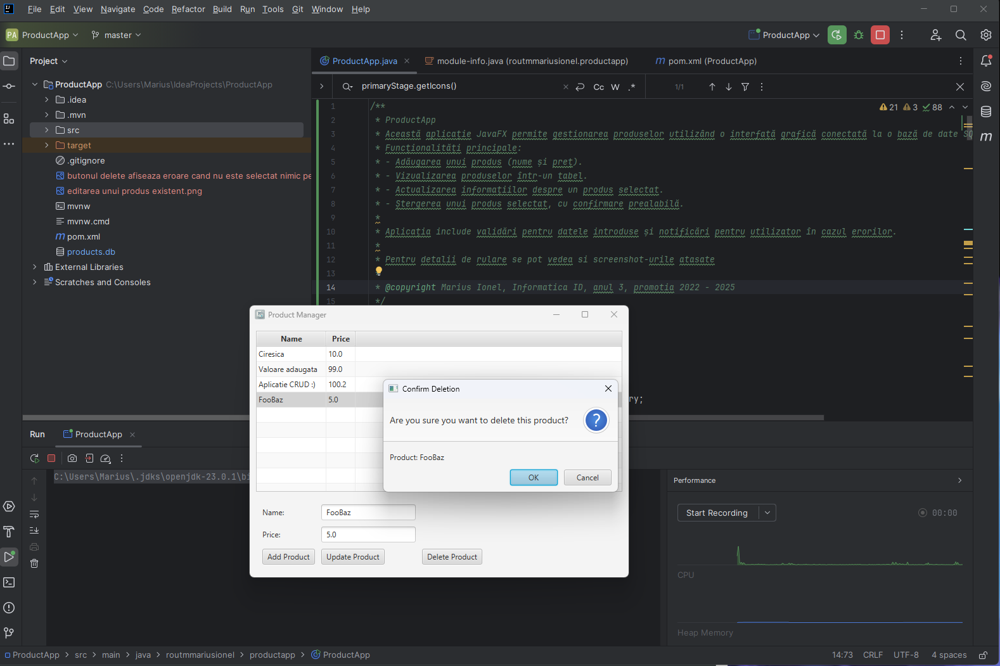
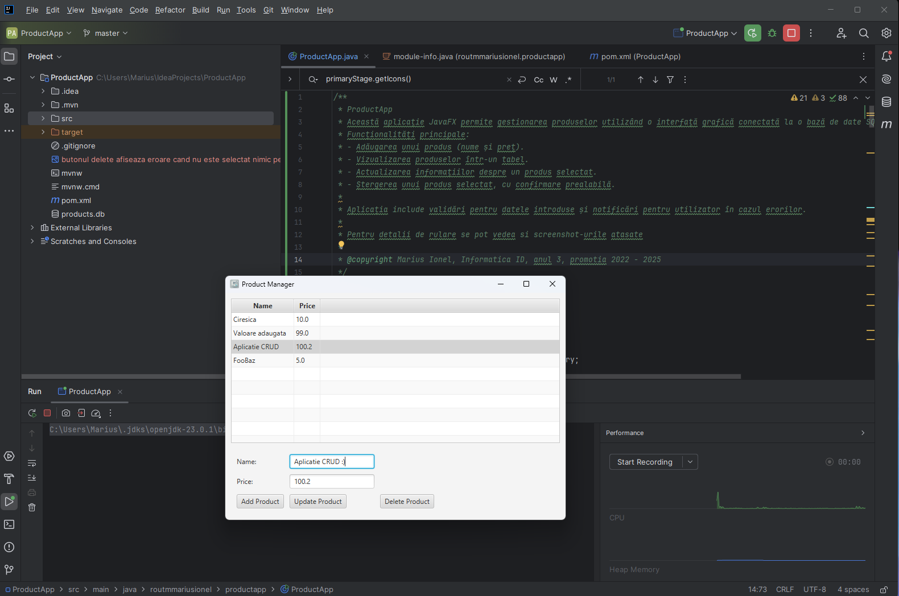

# ProductApp

> WARNING: This is a poject for Proiectarea Interfetelor Utilizator Homework

> DO NOT USE IT IN PRODUCTION

> ALL RIGHTS RESERVED

> Vezi repo parinte: [Proiectarea Interfetelor Utilizator](https://github.com/lightvision/Proiectarea_Interfetelor_Utilizator)

---

* Această aplicație JavaFX permite gestionarea produselor utilizând o interfață grafică conectată la o bază de date SQLite.
 * Funcționalități principale:
 * - Adăugarea unui produs (nume și preț).
 * - Vizualizarea produselor într-un tabel.
 * - Actualizarea informațiilor despre un produs selectat.
 * Aplicația include validări pentru datele introduse și notificări pentru utilizator în cazul erorilor.

## Screenshots:
- Stergerea unei intrari doar daca aceasta este selectata: 
- Stergerea inregistrarilor doar cu confirmare: 
- Editarea unui produs exisstent: 
